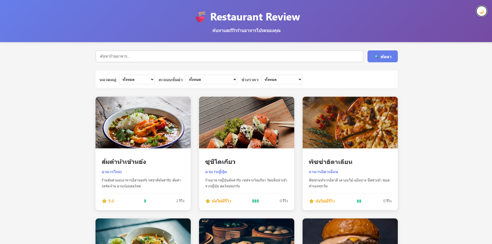
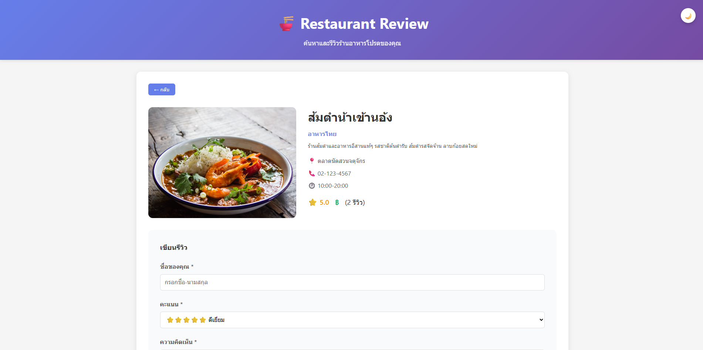
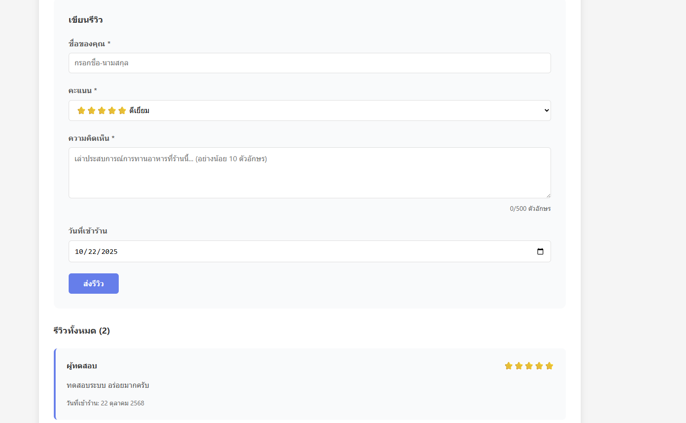
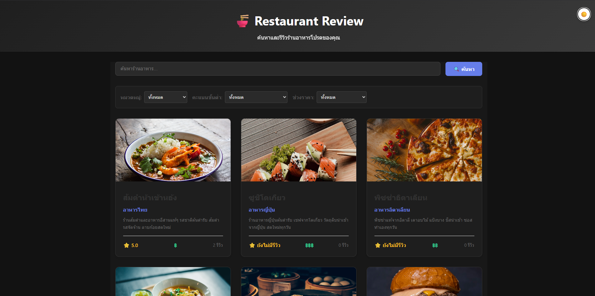

# 🍜 Restaurant Review Website

## 📖 รายละเอียดโปรเจกต์

เว็บไซต์รีวิวร้านอาหาร ที่ผู้ใช้สามารถเพิ่ม ลบ แก้ไข และดูรายละเอียดร้านอาหารได้
โปรเจกต์นี้ทำขึ้นเพื่อฝึกฝนการเขียน Full Stack โดยใช้ React, Node.js และ MySQL

## ⚙️ เทคโนโลยีที่ใช้

* **Frontend:** React.js, CSS
* **Backend:** Node.js, Express.js
* **Database:** MySQL

## 🚀 Features ที่มี

* CRUD (Create, Read, Update, Delete) 📝
* ดูรายละเอียดร้านอาหาร (View restaurant details) 📖
* เพิ่มร้านอาหารใหม่ (Add a new restaurant) ✅
* แก้ไขข้อมูลร้านอาหาร (Edit restaurant information) ✏️
* ลบร้านอาหาร (Delete restaurant) ❌
* Responsive Design (รองรับทุกหน้าจอ) 📱💻

## 📡 API Endpoints

| Method | Endpoint | Description |
| :--- | :--- | :--- |
| `GET` | `/api/restaurants` | `ดึงข้อมูลร้านอาหารทั้งหมด` |
| `GET` | `/api/restaurants/:id` | `ดึงข้อมูลร้านอาหาร 1 ร้าน` |
| `POST` | `/api/restaurants` | `เพิ่มร้านอาหาร` |
| `PUT` | `/api/restaurants/:id` | `แก้ไขร้านอาหาร` |
| `DELETE`| `/api/restaurants/:id` | `ลบร้านอาหาร` |

## 💻 วิธีการติดตั้ง

```bash
# 1. Clone repo
git clone [URL_ของ_REPOSITORY]

# 2. Install dependencies (Frontend)
cd frontend
npm install

# 3. Install dependencies (Backend)
cd backend
npm install

# 4. Start servers
# (อย่าลืมสร้าง .env และไฟล์ database)
npm start # (for frontend)
npm start # (for backend)
```

## 🖼️ ตัวอย่างหน้าเว็บ
### หน้าหลัก (Homepage)


### รหน้ารายละเอียดร้าน


### ฟอร์มรีวิว


### หน้าหลัก (Dark Mode)


## ผู้พัฒนา
- ชื่อ-นามสกุล เบญจรงค์ กันทาใจ
- รหัสนักศึกษา 66543206047-3
- Email bankkanthajai@gmail.com

## License
MIT License
